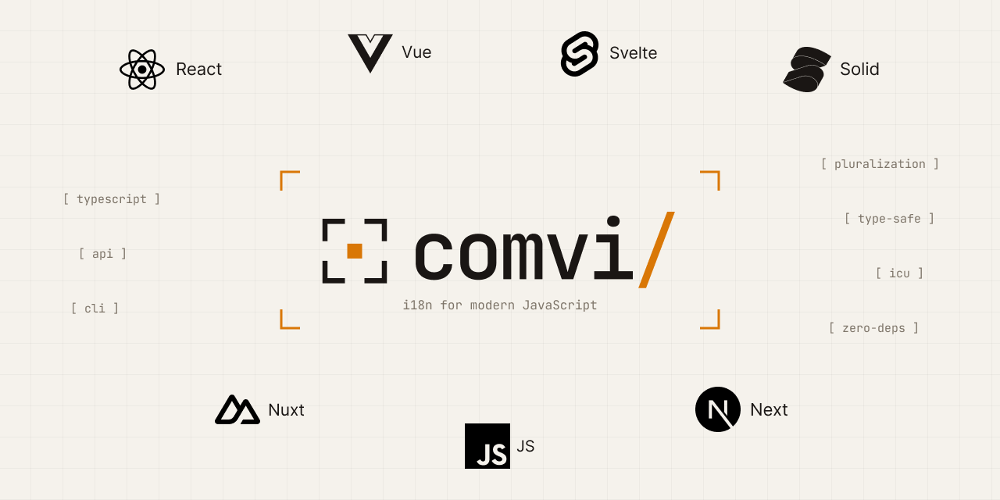

<p align="center">
  <picture>
    <source media="(prefers-color-scheme: dark)" srcset="../../.github/assets/header-logo-dark.png">
    
  </picture>
</p>

<h1 align="center">@comvi/core</h1>

<p align="center">Framework-agnostic i18n runtime for JavaScript and TypeScript.</p>

<p align="center">
  <a href="https://www.npmjs.com/package/@comvi/core"></a>
  <a href="https://bundlejs.com/?q=%40comvi%2Fcore"></a>
  <a href="https://github.com/comvi-io/comvi-js/blob/main/LICENSE"></a>
</p>

---

`@comvi/core` is the framework-independent runtime that powers every Comvi i18n binding. If you already use [`@comvi/vue`](../vue), [`@comvi/react`](../react), [`@comvi/solid`](../solid), [`@comvi/svelte`](../svelte), [`@comvi/next`](../next), or [`@comvi/nuxt`](../nuxt), you have it transitively — install this package directly only when you're building a custom integration or running Comvi i18n in vanilla Node/browser code.

Ships an ICU MessageFormat parser, a plugin system, and locale-aware `Intl` formatters out of the box.

## About Comvi i18n

Comvi i18n is a modern, framework-agnostic internationalization library — ICU MessageFormat, rich-text component embedding, and locale-aware `Intl` formatters in **~8 kB gzipped** with **zero runtime dependencies** and **no `eval`** (CSP-safe for Chrome extensions, Cloudflare Workers, and locked-down enterprise apps).

- **Same API** across [Vue](https://www.npmjs.com/package/@comvi/vue), [React](https://www.npmjs.com/package/@comvi/react), [SolidJS](https://www.npmjs.com/package/@comvi/solid), [Svelte](https://www.npmjs.com/package/@comvi/svelte), [Next.js](https://www.npmjs.com/package/@comvi/next), and [Nuxt](https://www.npmjs.com/package/@comvi/nuxt).
- **Real ICU MessageFormat** — locale-correct plurals, ordinals, and gender via `Intl.PluralRules`. Recognized by every major TMS.
- **Type-safe translation keys** via TypeScript declaration merging — autocomplete and parameter validation everywhere.
- **Pluggable** — translation loading, locale detection, and in-context editing are opt-in plugins.

See the [main repo](https://github.com/comvi-io/comvi-js) for the full library overview, runnable demos, and the framework binding matrix.

## Why @comvi/core?

- **Zero runtime dependencies, ~8 kB gzipped** — drops into any JS environment without a tree of transitive packages.
- **No `eval` or `new Function`** — runs under a strict CSP without `unsafe-eval`. Safe for Chrome extensions, Cloudflare Workers, and locked-down enterprise apps.
- **Plugin system, not a kitchen sink** — translation loading, locale detection, and editing are opt-in plugins. You only ship what you use.

📖 **Documentation:** https://comvi.io/docs/i18n/vanilla/

## Install

```bash
npm install @comvi/core
```

## Quick start

```ts
import { createI18n } from "@comvi/core";

const i18n = createI18n({
  locale: "en",
  fallbackLocale: "en",
  translation: {
    en: {
      greeting: "Hello, {name}!",
      items: "{count, plural, one {# item} other {# items}}",
    },
    uk: {
      greeting: "Привіт, {name}!",
      items: "{count, plural, one {# елемент} few {# елементи} other {# елементів}}",
    },
  },
});

await i18n.init();

i18n.t("greeting", { name: "Alice" }); // "Hello, Alice!"
i18n.t("items", { count: 5 }); // "5 items"
```

## ICU MessageFormat — locale-correct grammar, not just singular/plural

`count === 1 ? "item" : "items"` works in English. It silently ships broken grammar in Polish, Ukrainian, Arabic, Welsh, and 30+ other locales — those languages have 3, 4, sometimes 6 distinct plural categories that a binary if/else can't express. [ICU MessageFormat](https://unicode-org.github.io/icu/userguide/format_parse/messages/) is the standard syntax for handling them — the same syntax Crowdin, Lokalise, Phrase, and every major TMS already speak. Comvi i18n parses it via native [`Intl.PluralRules`](https://developer.mozilla.org/en-US/docs/Web/JavaScript/Reference/Global_Objects/Intl/PluralRules), so every CLDR plural category is correct by default.

### Plurals across languages

```json
{
  "en": { "messages": "{count, plural, one {# message} other {# messages}}" },
  "uk": {
    "messages": "{count, plural, one {# повідомлення} few {# повідомлення} many {# повідомлень} other {# повідомлення}}"
  },
  "ar": {
    "messages": "{count, plural, zero {لا توجد رسائل} one {رسالة واحدة} two {رسالتان} few {# رسائل} many {# رسالة} other {# رسالة}}"
  }
}
```

```ts
i18n.t("messages", { count: 0 }); // ar: "لا توجد رسائل"      (zero form)
i18n.t("messages", { count: 1 }); // en: "1 message"            uk: "1 повідомлення"
i18n.t("messages", { count: 5 }); // en: "5 messages"           uk: "5 повідомлень"          ar: "5 رسائل"
i18n.t("messages", { count: 22 }); // uk: "22 повідомлення"  ← the "few" form, NOT the "many" form
```

A naive English-style `count === 1 ? singular : plural` picks one Ukrainian form and ships it for every count — grammatically wrong for half your traffic.

### Ordinals (1st, 2nd, 3rd…)

```json
{ "rank": "{place, selectordinal, one {#st} two {#nd} few {#rd} other {#th}}" }
```

```ts
i18n.t("rank", { place: 1 }); // "1st"
i18n.t("rank", { place: 22 }); // "22nd"
i18n.t("rank", { place: 113 }); // "113th"
```

### Select (gender, role, status)

```json
{ "greeting": "{gender, select, female {Welcome, madam} male {Welcome, sir} other {Welcome}}" }
```

```ts
i18n.t("greeting", { gender: "female" }); // "Welcome, madam"
i18n.t("greeting", { gender: "male" }); // "Welcome, sir"
i18n.t("greeting", { gender: "other" }); // "Welcome"
```

### Locale-aware Intl formatters

Numbers, dates, currency, and relative time follow the active locale via native `Intl`:

```ts
await i18n.setLocale("de");

i18n.formatNumber(1234.5); // "1.234,5"
i18n.formatCurrency(99.99, "USD"); // "99,99 $"
i18n.formatDate(new Date(), { dateStyle: "long" }); // "15. Januar 2025"
i18n.formatRelativeTime(-2, "hour"); // "vor 2 Stunden"

i18n.dir; // "ltr" | "rtl" — handles script subtags (ku-Arab → rtl, ks-Deva → ltr)
```

## Type-safe translation keys

Declaration merging on `TranslationKeys` provides autocomplete and parameter validation per key. Generated automatically via [`@comvi/cli`](../cli) (TMS) or [`@comvi/vite-plugin`](../vite-plugin) (local JSON).

```typescript
// src/types/i18n.d.ts
declare module "@comvi/core" {
  interface TranslationKeys {
    welcome: { name: string };
    greeting: never;
    "errors:NOT_FOUND": never;
  }
}
```

```ts
// ✓ Compiles — params shape matches the declaration
i18n.t("welcome", { name: "Alice" });

// ✓ No params needed
i18n.t("greeting");

// ✓ Namespaced keys use the ns option
i18n.t("NOT_FOUND", { ns: "errors" });
```

**What TypeScript catches:**

```ts
// ✗ Expected 2 arguments, but got 1
i18n.t("welcome");

// ✗ Property 'name' is missing in type '{ age: number }'
i18n.t("welcome", { age: 5 });

// ✗ Type 'number' is not assignable to type 'string'
i18n.t("welcome", { name: 42 });

// ✗ Argument of type '"typo"' is not assignable to parameter
i18n.t("typo", { name: "Alice" });
```

## Plugins

Translation loading, locale detection, and editing are opt-in plugins. Pass them through `.use()` before `.init()`:

```ts
import { createI18n } from "@comvi/core";
import { FetchLoader } from "@comvi/plugin-fetch-loader";
import { LocaleDetector } from "@comvi/plugin-locale-detector";

const i18n = createI18n({ locale: "en", fallbackLocale: "en" })
  .use(
    LocaleDetector({
      order: ["querystring", "cookie", "localStorage", "navigator"],
      lookupCookie: "i18n_locale",
    }),
  )
  .use(
    FetchLoader({
      cdnUrl: "https://cdn.comvi.io/your-distribution-id",
    }),
  );

await i18n.init();
```

Plugins run sequentially during `.init()`, with timeout protection (10s default) and error recovery for non-required plugins. Each can return a cleanup function called on `.destroy()` in LIFO order.

For the full API — namespaces, fallback chains, missing-key handling, RTL detection, lifecycle events, and writing your own plugins — see the [documentation](https://comvi.io/docs/i18n/vanilla/).

## License

[MIT](https://github.com/comvi-io/comvi-js/blob/main/LICENSE) © Comvi
