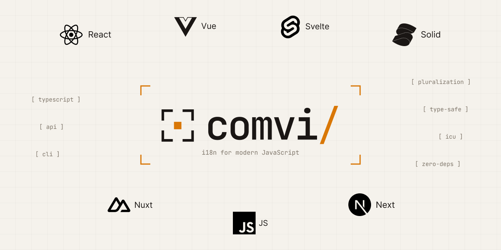

<p align="center">
  <picture>
    <source media="(prefers-color-scheme: dark)" srcset="../../.github/assets/header-logo-dark.png">
    
  </picture>
</p>

<h1 align="center">@comvi/vue</h1>

<p align="center">Vue 3 binding for Comvi i18n — plugin, composable, and <code>&lt;T&gt;</code> component.</p>

<p align="center">
  <a href="https://www.npmjs.com/package/@comvi/vue"></a>
  <a href="https://bundlephobia.com/package/@comvi/vue"></a>
  <a href="https://github.com/comvi-io/comvi-js/blob/main/LICENSE"></a>
</p>

---

`@comvi/vue` wraps [`@comvi/core`](../core) for Vue 3. `app.use(i18n)` installs `$t` and `$i18n` global properties; `useI18n()` returns reactive refs that integrate with Vue's reactivity system.

Same `t()` and `<T>` API as the [React](../react), [SolidJS](../solid), and [Svelte](../svelte) bindings — switch frameworks without relearning your i18n layer.

For Nuxt 3, use [`@comvi/nuxt`](../nuxt) — it adds SSR, locale routing, and auto-imports on top of this package.

📖 **Documentation:** https://comvi.io/docs/i18n/vue/

## Why Comvi i18n?

Comvi i18n is a modern, framework-agnostic internationalization library built on three principles: type-safe translations, real ICU MessageFormat, and zero compromises on bundle size or security.

- **Rich text without XSS.** Embed components inside translation strings (`Click <link>here</link>`) — translators see clean markup, you decide what each tag renders to. No raw HTML, no unsafe DOM injection, no splitting a sentence across template fragments.
- **Real ICU MessageFormat.** Plurals, ordinals, and select all follow locale-correct grammar via `Intl.PluralRules` — Polish, Ukrainian, Arabic, Welsh, and the rest. Same syntax every major TMS (Crowdin, Lokalise, Phrase) already speaks.
- **Locale-aware formatters built in.** `formatNumber`, `formatDate`, `formatCurrency`, and `formatRelativeTime` follow the active locale via native `Intl`, with reactive updates in every framework binding.
- **~8 kB minified + gzipped (as bundled by your app), zero runtime dependencies.** No `eval` or `new Function` anywhere — runs under a strict CSP without `unsafe-eval`. Safe for Chrome extensions, Cloudflare Workers, and locked-down enterprise apps.
- **Pluggable, not monolithic.** Translation loading (CDN/API), locale detection, and in-context editing are opt-in plugins via `@comvi/plugin-fetch-loader`, `@comvi/plugin-locale-detector`, and `@comvi/plugin-in-context-editor`. You only ship what you use.
- **Same API across 6 frameworks.** `useI18n()` and `<T>` look the same in [Vue](https://www.npmjs.com/package/@comvi/vue), [React](https://www.npmjs.com/package/@comvi/react), [SolidJS](https://www.npmjs.com/package/@comvi/solid), [Svelte](https://www.npmjs.com/package/@comvi/svelte), [Next.js](https://www.npmjs.com/package/@comvi/next), and [Nuxt](https://www.npmjs.com/package/@comvi/nuxt) — switch frameworks without relearning your i18n layer.

## Why @comvi/vue?

- **Reactivity first.** `useI18n()` returns Vue refs and computed properties — changes to language or translations trigger precise re-renders without manual store subscriptions.
- **Template-native API.** `<T>` component uses named slots for tag interpolation; `$t` template helper and `$i18n` global property eliminate boilerplate in Options API code.
- **Single plugin, both APIs.** One `app.use(i18n)` install works seamlessly with Composition API, Options API, and component templates.

## Install

```bash
npm install @comvi/vue
# Peer: vue ^3.0.0
```

## Quick start

```ts
// main.ts
import { createApp } from "vue";
import { createI18n } from "@comvi/vue";
import App from "./App.vue";

const i18n = createI18n({
  locale: "en",
  fallbackLocale: "en",
  translation: {
    en: { greeting: "Hello, {name}!" },
    uk: { greeting: "Привіт, {name}!" },
  },
});

createApp(App).use(i18n).mount("#app");
```

```vue
<!-- App.vue -->
<script setup lang="ts">
import { useI18n } from "@comvi/vue";
const { t, locale, setLocale } = useI18n();
</script>

<template>
  <h1>{{ t("greeting", { name: "Alice" }) }}</h1>
  <select :value="locale" @change="setLocale(($event.target as HTMLSelectElement).value)">
    <option value="en">English</option>
    <option value="uk">Українська</option>
  </select>
</template>
```

For the `<T>` component (rich text with slot-based tag interpolation), `$t` template helper, type-safe keys, and the full composable API, see the [documentation](https://comvi.io/docs/i18n/vue/).

## Capability composables: `useI18nLoader()` / `useI18nPlugins()`

Async loading and the plugin host are `@comvi/core` **capabilities**, not part
of the translation core. Since 0.5.0 their members are acquired explicitly
rather than being handed out by `useI18n()`:

```vue
<script setup lang="ts">
import { useI18n, useI18nLoader, useI18nPlugins } from "@comvi/vue";

const { t } = useI18n("admin");
const { addActiveNamespace, reloadTranslations, onLoadError } = useI18nLoader();
const { onMissingKey } = useI18nPlugins();
</script>
```

Neither takes parameters — the namespace argument stays on `useI18n(ns)`. The
bag is referentially stable per host instance (keyed on the core, so two
`VueI18n` wrappers over one host share it).

On a host that lacks the capability the acquisition call throws — in
development **and** production, never a silent no-op:

```
[comvi] This i18n instance has no loader capability. Attach it: import { attachLoader } from "@comvi/core/loader" — or use the root "@comvi/core" entry.
```

**`VueI18n` dropped its eight instance proxies.** `addActiveNamespace`,
`reloadTranslations`, `registerLoader`, `registerLocaleDetector`,
`registerPostProcessor`, `onMissingKey`, `onLoadError` and `use` are gone from
the class; the host it wraps is public as `readonly core`, so registration
happens there:

```diff
-i18n.registerLoader(myLoader);
-i18n.use(FetchLoader({ … }));
+i18n.core.registerLoader(myLoader);
+i18n.core.use(FetchLoader({ … }));
```

Note that `i18n.core.use(…)` returns the host, not the wrapper, so it no longer
chains off the `createI18n(…)` call. Nothing on `VueI18n` is typed present and
then throws "missing capability" — that is why `use` left with the rest.

Migrating from 0.4.x: `pnpm codemod:framework-slim "src/**/*.{ts,vue}"` (it
rewrites the destructures and _reports_ the proxy call sites, whose receiver
type is textually undecidable), or the
[0.5.0 migration guide](https://github.com/comvi-io/comvi-js/blob/main/MIGRATION.md).

## Supported hosts and what they cost

`createI18n(options)` is unchanged and still the default — it builds the root
core internally. `createI18nFromCore(core, options?)` wraps a host you composed
yourself, preserving its exact type as `i18n.core`.

**For a slim build, import from `@comvi/vue/slim`.** The main entry
tree-shakes the root graph out of a `createI18nFromCore`-only app under esbuild,
vite (development and production) and webpack production — but not under
webpack _development_: `@comvi/vue`'s index carries `export * from "@comvi/core"`,
and webpack cannot prune a star re-export with `usedExports` off, so the root
entry survives and runs core's ambient `registerTagSyntax()` — which makes
`t("a <b>x</b>")` render differently in dev than in prod. `@comvi/vue/slim`
ships the same classes, composables, `<T>` and injection key without
`createI18n` and without the core re-export.

```ts
import { createI18n } from "@comvi/core/slim";
import { attachLoader } from "@comvi/core/loader";
import { createI18nFromCore } from "@comvi/vue/slim";

const host = attachLoader(createI18n({ locale: "en" }));
const i18n = createI18nFromCore(host); // i18n.core is exactly `host`
```

Whole-app comvi graph, min+gz, `vue` externalized
(`node scripts/size-check.mjs`):

| host                                            | no `<T>` | with `<T>` |
| ----------------------------------------------- | -------- | ---------- |
| `@comvi/core` (root, via `createI18n`)          | 10354    | 11370      |
| bare `@comvi/core/slim` (via `@comvi/vue/slim`) | **6868** | 8844       |

Moving to a bare slim host saves **3486 B (−33.7%)**. The root row also dropped
1576 B in 0.5.0 with no app change: `@comvi/vue` no longer inlines copies of
core's tag + translate chunks into its own bundle, and `<T>` moved into its own
dist chunk, so an app that never renders it ships neither; core's own size work in the same release accounts for the last 181 B.

## Rich text with `<T>`

Embed components inside translation strings without raw HTML, without unsafe DOM injection. Translators see clean markup; you control the rendering via named slots.

```json
{ "help": "Read <link>our docs</link> or <bold>contact us</bold>." }
```

```vue
<script setup lang="ts">
import { T } from "@comvi/vue";
</script>

<template>
  <T i18nKey="help">
    <template #link="{ children }">
      <a href="/docs">{{ children }}</a>
    </template>
    <template #bold="{ children }">
      <strong>{{ children }}</strong>
    </template>
  </T>
</template>
```

Alternatively, use the `components` prop for programmatic tag handling. Pass `tagInterpolation: { strict: "warn" }` to `createI18n` to catch translations referencing tags you forgot to handle before they ship.

## ICU MessageFormat — locale-correct grammar, not just singular/plural

`count === 1 ? "item" : "items"` works in English. It silently ships broken grammar in Polish, Ukrainian, Arabic, Welsh, and 30+ other locales — those languages have 3, 4, sometimes 6 distinct plural categories that a binary if/else can't express. [ICU MessageFormat](https://unicode-org.github.io/icu/userguide/format_parse/messages/) is the standard syntax for handling them — the same syntax Crowdin, Lokalise, Phrase, and every major TMS already speak. Comvi i18n parses it via native [`Intl.PluralRules`](https://developer.mozilla.org/en-US/docs/Web/JavaScript/Reference/Global_Objects/Intl/PluralRules), so every CLDR plural category is correct by default.

### Plurals across languages

```json
{
  "en": { "messages": "{count, plural, one {# message} other {# messages}}" },
  "uk": {
    "messages": "{count, plural, one {# повідомлення} few {# повідомлення} many {# повідомлень} other {# повідомлення}}"
  },
  "ar": {
    "messages": "{count, plural, zero {لا توجد رسائل} one {رسالة واحدة} two {رسالتان} few {# رسائل} many {# رسالة} other {# رسالة}}"
  }
}
```

```ts
t("messages", { count: 0 }); // ar: "لا توجد رسائل"      (zero form)
t("messages", { count: 1 }); // en: "1 message"            uk: "1 повідомлення"
t("messages", { count: 5 }); // en: "5 messages"           uk: "5 повідомлень"          ar: "5 رسائل"
t("messages", { count: 22 }); // uk: "22 повідомлення"  ← the "few" form, NOT the "many" form
```

A naive English-style `count === 1 ? singular : plural` picks one Ukrainian form and ships it for every count — grammatically wrong for half your traffic.

### Ordinals (1st, 2nd, 3rd…)

```json
{ "rank": "{place, selectordinal, one {#st} two {#nd} few {#rd} other {#th}}" }
```

```ts
t("rank", { place: 1 }); // "1st"
t("rank", { place: 22 }); // "22nd"
t("rank", { place: 113 }); // "113th"
```

### Select (gender, role, status)

```json
{ "greeting": "{gender, select, female {Welcome, madam} male {Welcome, sir} other {Welcome}}" }
```

```ts
t("greeting", { gender: "female" }); // "Welcome, madam"
t("greeting", { gender: "male" }); // "Welcome, sir"
t("greeting", { gender: "other" }); // "Welcome"
```

### Locale-aware Intl formatters

Numbers, dates, currency, and relative time follow the active locale via native `Intl` — reactive in your framework binding:

```vue
<script setup lang="ts">
import { useI18n } from "@comvi/vue";

const { t, locale, setLocale, formatCurrency, formatRelativeTime, formatDate } = useI18n();
</script>

<template>
  <div>
    <!-- Locale-aware plurals -->
    <p>{{ t("items", { count: 5 }) }}</p>

    <!-- Locale-aware Intl formatters — re-render when setLocale() is called -->
    <p>Price: {{ formatCurrency(99.99, "USD") }}</p>
    <p>Posted {{ formatRelativeTime(-2, "hour") }}</p>
    <p>Date: {{ formatDate(new Date(), { dateStyle: "long" }) }}</p>

    <select :value="locale" @change="setLocale(($event.target as HTMLSelectElement).value)">
      <option value="en">English</option>
      <option value="fr">Français</option>
    </select>
  </div>
</template>
```

Switching locale via `setLocale()` re-renders all formatters automatically through Vue's reactivity.

## Type-safe translation keys

Declaration merging on `TranslationKeys` provides autocomplete and parameter validation per key. Generated automatically via `@comvi/cli` (TMS) or `@comvi/vite-plugin` (local JSON).

```typescript
// src/types/i18n.d.ts
declare module "@comvi/core" {
  interface TranslationKeys {
    welcome: { name: string };
    greeting: never;
    "errors:NOT_FOUND": never;
  }
}
```

```vue
<script setup lang="ts">
import { useI18n } from "@comvi/vue";

const { t } = useI18n();

// ✓ Autocomplete works, params required
t("welcome", { name: "Alice" });

// ✓ No params needed
t("greeting");

// ✓ Namespaced keys use the ns option
t("NOT_FOUND", { ns: "errors" });
</script>
```

**What TypeScript catches:**

```ts
// ✗ Expected 2 arguments, but got 1
t("welcome");

// ✗ Property 'name' is missing in type '{ age: number }'
t("welcome", { age: 5 });

// ✗ Type 'number' is not assignable to type 'string'
t("welcome", { name: 42 });

// ✗ Argument of type '"typo"' is not assignable to parameter
t("typo", { name: "Alice" });
```

## Loading translations from the Comvi platform

Pair with `@comvi/plugin-fetch-loader` to load translations from a CDN or API. No redeploy needed to ship a translation:

```ts
// main.ts
import { createApp } from "vue";
import { createI18n } from "@comvi/vue";
import { FetchLoader } from "@comvi/plugin-fetch-loader";
import App from "./App.vue";

const i18n = createI18n({
  locale: "en",
  defaultNs: "common",
});

// CDN for production, API for dev/staging.
// Plugin registration is a core capability: `VueI18n` exposes the host it
// wraps as `i18n.core`, and that is where plugins are registered in 0.5.0.
i18n.core.use(
  FetchLoader({
    cdnUrl: "https://cdn.comvi.io/your-distribution-id",
  }),
);

createApp(App).use(i18n).mount("#app");
```

See [`@comvi/plugin-fetch-loader`](https://github.com/comvi-io/comvi-js/tree/main/packages/plugin-fetch-loader) for full options and API endpoints.

## License

[MIT](https://github.com/comvi-io/comvi-js/blob/main/LICENSE) © Comvi
